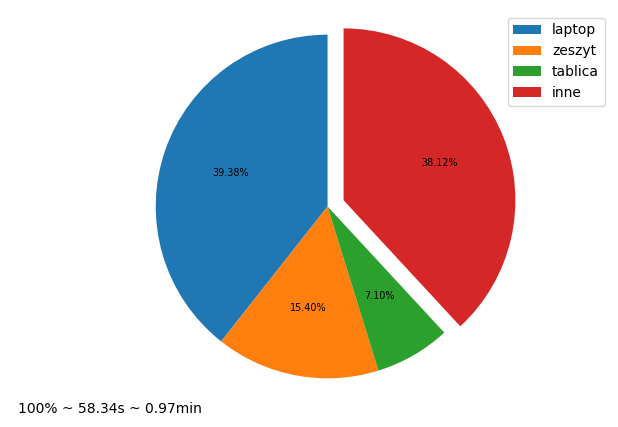
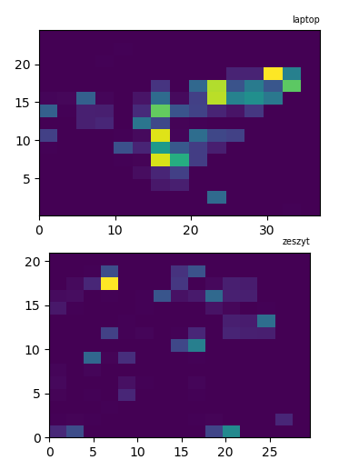
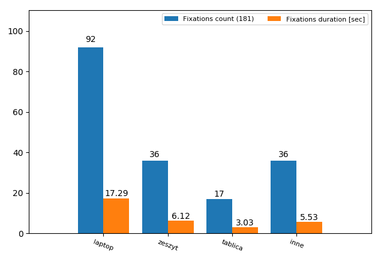
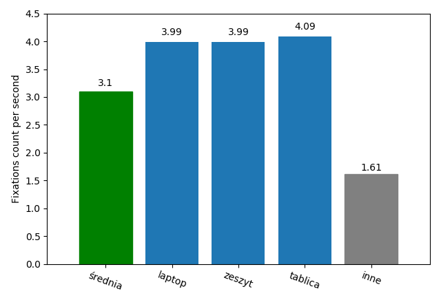
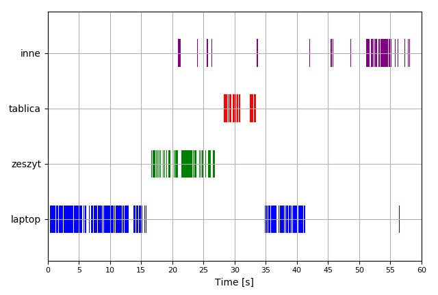

# Plot Report Generator

**Pupil Player plugin**

Download PDF reports with various plots and charts.

Before generating any reports,
in order to export eyetracking data in CSV format, 
use **Raw Data Exporter** plugin
with enabled plugins:
 - Surface Tracker
 - Fixation Detector
 
In order to use this plugin you have to **run this Pupil application from source**.
## Report content
### Surfaces visibility
This plot shows how many time user was looking at particular surface,
which was previously defined. 

Eye-tracking data on the basis of which plot
was made, were taken from file called *surface_gaze_distribution.csv*.
That file contains information about:
- number of gaze points on particular areas (surfaces) 
- total number of gaze points in whole recording 
(*'total_gaze_point_count'* parameter).

### Heatmaps
Heatmaps visualizes the distribution of gaze points that lie within each surface.
Lighter colors represents areas where the amount of time spend gazing on this region
was the biggest (i.e. there were more gaze points registered in this region). Dark places
on map are areas avoided by person's gaze

### Fixations (count & duration) on surface
This plot shows number of fixation on particular surfaces and their
duration. 

Data from files with prefix *'fixations_on_surface_'* were used to
generate this plot. These files contains parameters like:
- *id* - identification number,
- *start_timestamp* - start of fixation,
- *duration* - fixation duration [ms],
- *on_srf* - determines whether fixation was detecter on surface or not.

**ATTENTION**: Only fixations with parameter *'on_srf'* equal *True* were taken
into account. In some cases, this parameter has the same value for more
than one surface that is why some discrepancies in total number of
fixations can occur.

### Fixations frequency
Plot shows fixation frequencies on particular surfaces. Average
frequency is equal to quotient of:
- number of all fixations
- and total duration of recording.

On the other hand, frequency of fixations on particular area is equal to
quotient of:
- number of fixations on this surface
- and time spent on looking at this area.

Data from:
 - *surface_gaze_distribution.csv* file
 - files with prefix *'fixations_on_surface_'* 
 
 were used to create this plot.

### Fixations on timeline
 This plot shows fixations on timeline. Data from files named „info.csv”
and with prefix „fixations_on_surface” were used to create this plot.
Parameters which were use to calculation are:
- *start_timestamp* - start of every fixation,
- *duration* - duration of particular fixations,
- *Start Time (Synced)* - recording start timestamp,
- *Duration Time* - recording duration.

## License
All source code written by Pupil Labs is open for use in compliance with the [GNU Lesser General Public License (LGPL v3.0)](http://www.gnu.org/licenses/lgpl-3.0.en.html). We want you to change and improve the code -- make a fork! Make sure to share your work with the community!
